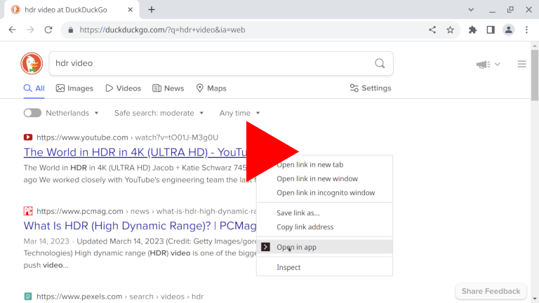

# url2app

Browser extension to open any page or link in any external app. **No** running native client required.

## How does it work

Browser extension redirects page or link you choose to custom `x-url2app://` protocol URL, which is then handled by user-defined protocol handler script (e.g. [url2app.sh](host/nix/url2app.sh)).


## Video demo

[](https://youtu.be/NwOq3RuCd0k)


## Installation

1. Install browser extension

    - [Firefox](https://addons.mozilla.org/firefox/addon/url2app)

    - Chrome and Chromium-based: [load unpacked extension](https://developer.chrome.com/extensions/getstarted#unpacked) for now

2. Create `x-url2app://` protocol handler script and register it with your host OS, see [Host-side installation](#host-side-installation) section for [Linux / *BSD](#linux--bsd) or [Windows](#windows).

3. Right-click on any page or link → Open in app. Or click on the extension icon in the toolbar.

    On the first time, browser will ask for confirmation, you can check "Always allow..." to open links without confimation in future.

    '*Good news! x-url2app:// protocol handler is working fine!*' message should appear.

4. By default, 'Open in app' menu entry shows on all pages and for all links. You can change this in extension options, providing your own list of [host match patterns](https://developer.mozilla.org/docs/Mozilla/Add-ons/WebExtensions/Match_patterns).


## Host-side installation

### Linux / *BSD

- **Automatic**

  - Review [install script](host/nix/install.sh)

  - Download and run it:
    ```sh
    wget -O- https://github.com/shvchk/url2app/raw/main/host/nix/install.sh | bash
    ```

  This will do everything described in **Manual** subsection below, automatically.

  [Example script](host/nix/url2app.sh) `~/.local/bin/url2app.sh` has several handlers, which are disabled by default. Uncomment, change or add handlers as you like.

- **Manual**

  <details>
  <summary>Show</summary>

  - Create a script (e.g. `~/.local/bin/url2app.sh`) to redirect incoming links to actual apps, see [example `url2app.sh`](host/nix/url2app.sh)

  - Make it executable
    ```sh
    chmod +x ~/.local/bin/url2app.sh
    ```

  - Create a `.desktop` file (e.g. `~/.local/share/applications/url2app.desktop`) to run that script, see [example `url2app.desktop`](host/nix/url2app.desktop)

  - Register that `.desktop` file as a `x-url2app://` protocol handler:
    ```sh
    xdg-mime default ~/.local/share/applications/url2app.desktop x-scheme-handler/x-url2app
    ```

  - Rebuild database of MIME types handlers:
    ```sh
    update-desktop-database ~/.local/share/applications
    ```
  </details>


### Windows

- **Automatic**
  - Review [install script](host/windows/install.ps1)

  - [Download](https://github.com/shvchk/url2app/raw/main/host/windows/install.ps1) and run it: right click → Run with PowerShell

    The same can be done with one command from the terminal:
      ```pwsh
      irm https://github.com/shvchk/url2app/raw/main/host/windows/install.ps1 | iex
      ```

  [Example script](host/windows/url2app.js) `%LocalAppData%/url2app/url2app.js` has several handlers, which are disabled by default. Uncomment, change or add handlers as you like.
